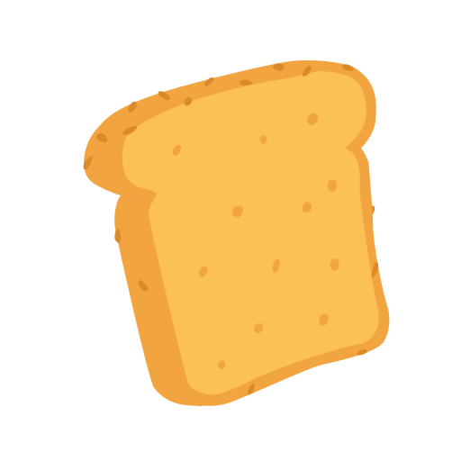
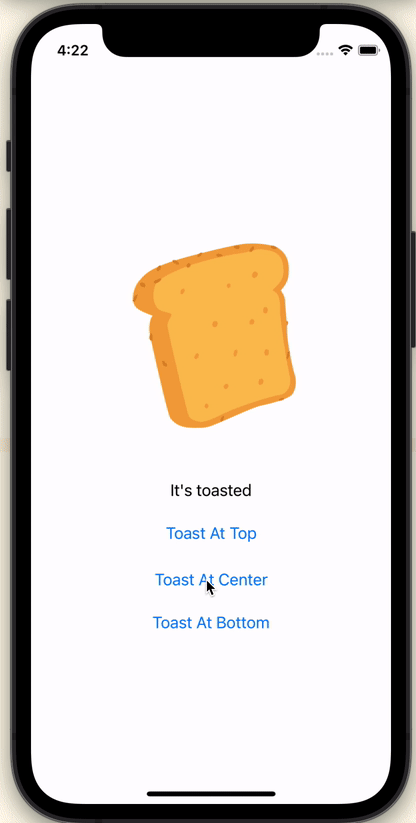

# Toast


[Icon created by Freepik - Flaticon](https://www.flaticon.com/free-icons/update)


## Overview

It's a simple way to pop a toast in SwiftUI.

- iOS 150+
- Support pop at `Top` `Center` and `Bottom`

## Previews




## Intallation

**Swift Package Manger**

If you use Swift Package Manager, simply add Toast as a dependency of your package in `Package.swift`:

```
.package(url: "https://github.com/RiuHDuo/Toast.git", from: "main")
```

## Quick Start

Import `Toast` into your swift file. Add `toast` modifier to the view.

Just pass a list of  `Binding<[ToastMessage]>` type to `toast` modifier.

When append data to list, toast will show one by one and remove from the list when disappear.

Example:

```swift
import SwiftUI
import Toast

struct ContentView: View {
    @State var toastList = [ToastMessage]()
    var body: some View {
      VStack{
          Text("It's toasted")
              .padding()
        
        	 Button {
                self.toastList.append(ToastMessage(title: "Toast"))
            } label: {
                Text("Toast")
            }
      }
      .toast(toastList: $toastList)
    }
}
```

**ToastMessage**

`ToastMessage` is the display content. 

You can create it like this:

```swift
ToastMessage(title: "Toast", 
             titleColor: Color.white, 
             subTitle: "It's toasted",
             subTitleColor: Color.white, 
             icon: Image(systemName: "applelogo").resizable().aspectRatio(contentMode: .fit).foregroundColor(.white))
```

Or create it with custom view:

```swift
ToastMessage(content: HStack{
                    Image(systemName: "sun.max.fill")
                        .resizable()
                        .aspectRatio(contentMode: .fit)
                        .foregroundColor(.red)
                        .frame(width: 16, height: 16)
                        .padding(.horizontal,8)
                    Text("Toast").bold().foregroundColor(.red)
                }, icon: Image(systemName: "applelogo").resizable().aspectRatio(contentMode: .fit).foregroundColor(.red))
```

**ToastMessageStyle**

You can custom toast's style by changing `ToastMessageStyle`  on `ToastMessage` constructor.

For now support:

- Set Toast position
- Set Toast background
- Set Toast with/without Vibration

For example:

```swift
// Color background
let style1 = ToastMessageStyle(position: .top, background: .orange, hasFeedback: true)

// or Blur background
let style2 = ToastMessageStyle(position: .bottom, background: .regularMaterial, hasFeedback: true)

// or Gradient background
 let colors = [Color(hue: 191 / 360.0, saturation: 0.91, brightness: 0.92), Color(hue: 280 / 360.0, saturation: 0.52, brightness: 0.93), Color(hue: 356 / 360.0, saturation: 0.68, brightness: 0.96)]

let style3 = ToastMessageStyle(position: .center, background: LinearGradient(colors: colors, startPoint: UnitPoint(x: 0, y: 0.5), endPoint: UnitPoint(x: 1, y: 0.5)), hasFeedback: true)

// Show Toast
self.toastList.append(ToastMessage(title: "Toast", style: style3))
```

## License

Distributed under the MIT License.
